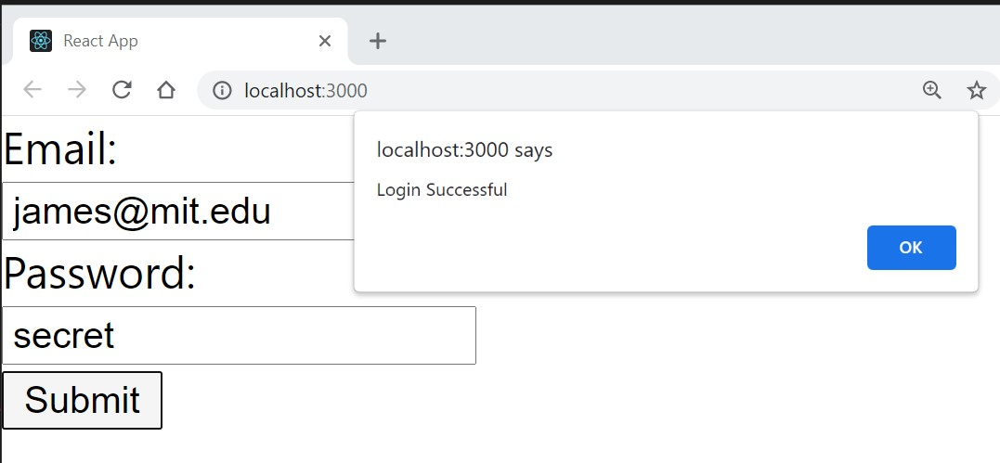

# Build-A-Formik-Form

### 

### 

## Description
In this activity, the task is to create a login form with validation using Formik.

The form should include the following:

Email field
Password field
Submit button

Implemented validation rules:

If the username or password inputs are empty, display the message "Field required" under the text input.
If the username is not in an email format, display the message "Username should be an email" under the text input.
If the username and password pass the above validations, then display the message "Login Successful" in an alert box.

## Installation 
Download and open the repo in Visual Studio Code (VSC).  Formik is a library that helps take the tedious parts of creating forms by simplifying the logic needed. To install Formik, type 'npm install formik --save' in terminal directory. 

### `npm start`

In VSC Termincal, type 'npm start' which will automatically a browser with [http://localhost:3000](http://localhost:3000)..

The page will reload if edits are saved.

## Usage
This project is an example of a form that is universal across many platforms. It uses React and Formik to create a more concise and logical code.

## Roadmap
My goal for this project is to continue learning how to use Formik to vaildate password length and character criteria.

## License Information
[MIT](https://choosealicense.com/licenses/mit/)
